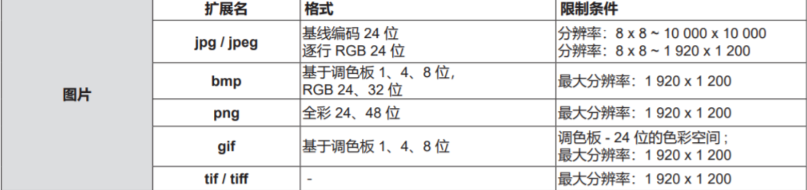

二、打开和关闭
##############
I. 连接电源线
*************

II. 链接电脑 
************

III. 安装模式
******************

安装模式考虑往后放（最要紧、最有用的信息项目放在前面）

IV. 遥控器
*************
.. image:: images/遥控器.png

.. note:: 
   下方展示和介绍的按钮是按照使用频率进行排序，不是按照数字号码
   顺序排序。

1. 电源按钮  （记得序号后面带一个空格）
+++++++++++++++++++++++++++++++++++++++++

.. image:: images/遥控器电源按钮.png

.. image:: images/电源指示灯.png
   :align: center

按钮图片大小需要重新调整,50%似乎可行

将投影机设置为关闭状态（待机模式） 。当电源设置为关闭状态（待机模式）时也可开启投影机。

.. warning::
   + 请避免遥控器跌落。

   + 请避免接触水或受潮。

   + 请勿试图修理或拆卸遥控器。

   + (这里的背景色能不能改？
     还有，中文说明书用英文标识语似乎不合适，是否用一个图标更加直观？)