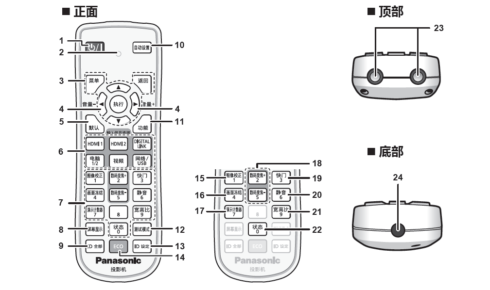
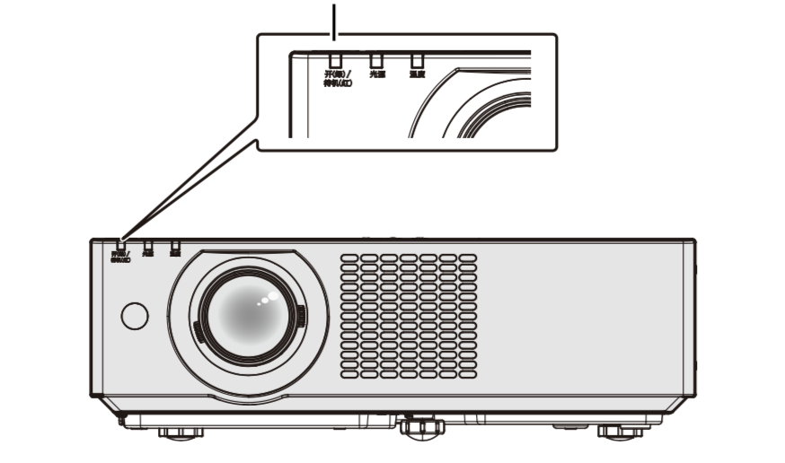
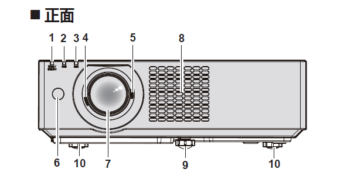
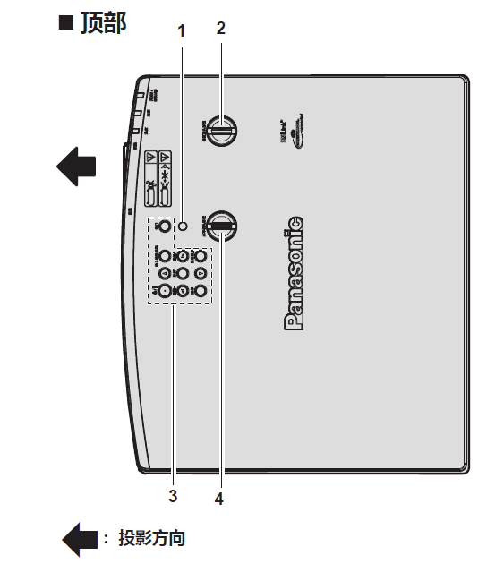
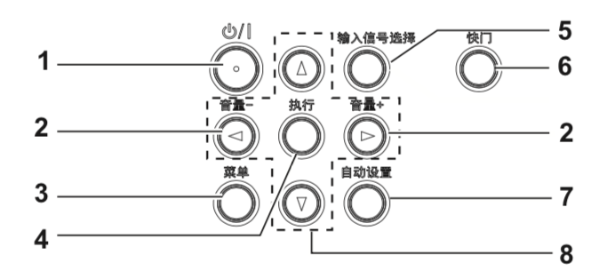
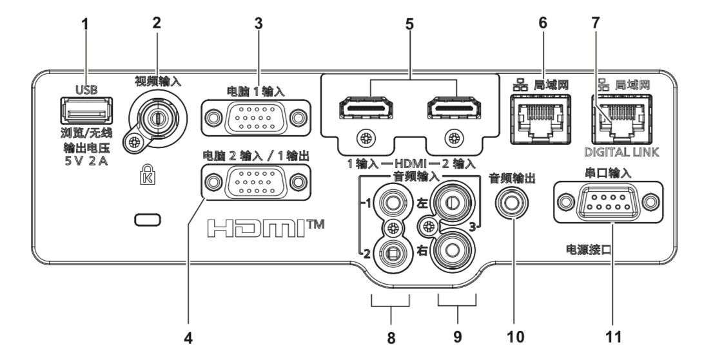

一、产品介绍
##############

I. 产品用途
*************

本产品用于将视频设备与电脑的静态/动态图像信号投影到屏幕上。

Ⅱ. 遥控器
*************

.. note:: 
   下方展示和介绍的按钮是按照使用频率进行排序，不是按照数字号码
   顺序排序。

1. 电源按钮  
+++++++++++++++++++++++++++++++++++++++++

将投影机设置为关闭状态（待机模式） 。当电源设置为关闭状态（待机模式）时也可开启投影机。

2. 遥控指示灯
++++++++++++++++

如果按遥控器上的任何按钮，指示灯会闪烁。

3. <菜单>/<返回>/<执行>按钮
++++++++++++++++++++++++++++++

用于浏览菜单画面，也用于在［安全］中输入密码或输入字符。

4. <音量->/<音量+> 按钮
++++++++++++++++++++++++++

调整内置扬声器或音频输出的音量。

6. 输入信号选择(<HDMI1>、<HDMI2>、<DIGITALLINK>、<电脑1/2>、<视频>、<网络/ USB>) 按钮
++++++++++++++++++++++++++++++++++++++++++++++++++++++++++++++++++++++++++++++++++++++++++

切换输入信号。

8. <屏幕显示> 按钮
++++++++++++++++++++++

打开（显示）/ 关闭（隐藏）屏幕显示功能。

10. <自动设置> 按钮
++++++++++++++++++++++

在投影图像期间自动调整图像显示位置。

15. <图像校正> 按钮
+++++++++++++++++++++++++

校正投影画面中的各种失真。

18. <数码变焦+>/<数码变焦-> 按钮
++++++++++++++++++++++++++++++++++

放大或缩小图像。

19. <快门> 按钮
+++++++++++++++++

用于暂时关闭图像和音频。

20. <静音> 按钮
++++++++++++++++++++

用于暂时关闭音频。

21. <宽高比> 按钮
++++++++++++++++++++++

切换图像的宽高比。

.. warning::
   + 请避免遥控器跌落。

   + 请避免接触水或受潮。

   + 请勿试图修理或拆卸遥控器。

Ⅲ. 电源指示灯
*****************

电源指示灯用来显示电源状态。

指示灯状态：

1. 熄灭

电源线未连接。

2. 红色

+ 点亮：

  电源关闭/待机模式。
  按电源按钮将开始投影。

+ 闪烁：

  电源关闭/待机模式。
  按电源按钮将开始投影。投影机进入高功耗状态。

3. 绿色

+ 点亮：

  投影机正在投影。

+ 闪烁：

  根据 [ 电源控制 ] 的设置，光源关闭。

4. 橙色

+ 点亮：

  投影机正在冷却。
  稍后电源关闭。(进入待机模式)

Ⅳ. 机身部件
***************

1）前端
++++++++++

本部分介绍了投影机机身正面的部件

1. 电源指示灯

指示电源状态。

绿色代表电源开启，红色代表待机状态

2. 光源指示灯

指示光源状态。

3. 温度指示灯

指示内部温度状态。

4. 聚焦调节杆

调整焦距

5. 变焦调节杆

调整变焦

6. 遥控信号接收器

7. 投影镜头

8. 进气口

9. 前可调支脚

调节投影角度。

10. 后可调支脚

调节投影角度。

2) 顶端
+++++++++

本部分介绍了投影机机身顶部的部件

1. 亮度传感器

2. 垂直镜头移位旋钮

调整垂直方向的投影位置。（垂直镜头移位）

3. 控制面板

4. 水平镜头移位旋钮

调整水平方向的投影位置。（水平镜头移位）

3）控制面板
+++++++++++++

本部分介绍了控制面板上面各个按钮的作用。

1. 电源按钮
将投影机设置为关闭状态(待机模式)。

当电源设置为关闭状态(待机模式)时也可开启投影机。

2. <音量->按钮/<音量+>按钮

调整内置􏰀声器和音频输出的音量。

3. <菜单>按钮

显示或隐藏主菜单。

显示子菜单时，会返回到前一个菜单。

4. <执行>按钮

确定并执行菜单屏幕中的项目。

5. <输入信号选择>按钮

切换输入信号进行投影。

6. <快门>按钮

用于暂时关闭图像和音频。

7. <自动设置>按钮

投影图像时使用自动调整功能自动调整图像显示的位置

4) 连接端子
+++++++++++++

端子是一种信号接口。本部分介绍了用来输入输出不同信号的端子。

1. < USB(浏览 / 无线 / 输出电压)>端子

使用 Memory Viewer 功能时，将 USB 存储器直接插入该端子。

当使用无线局域网功能时，请将选配的无线传输模块(型号 : AJ-WM50MC)直接插入此端子。

此外，该端子还可用于供电

2. <视频输入>端子

这是视频信号输入端子。

3.<电脑1输入>端子

这是 RGB 信号或 YCBCR/YPBPR 信号输入端子。

4. <电脑2输入/1输出>端子

这是 RGB 信号或 YCBCR/YPBPR 信号输入端子。

或将 <电脑 1 输入 > 端子输入的信号输出到外接设备。

5. <HDMI1输入端子/HDMI2输入>端子

这是 HDMI 信号输入端子。

6. <局域网>端子

这是用于连接网络的局域网端子。

此端子也支持从图像传输应用软件进行图像传输。

7. <DIGITAL LINK / 局域网 >端子

(不适用于 PT-BMZ40C 和 PT-BMX50C)

该端子用于连接输出视频和音频信号的设备。此外，这是用于连接网络的局域网端子。

8. <音频输入1端子/音频输入2>端子

这是音频信号输入端子。

9. <音频输入2>端子

这是音频信号输入端子。

左侧输入<左>和右侧输入<右>用于<音频输入 3>端子。

10. <音频输出>端子

这是投影机输入的音频信号的输出端子。

11. <音频输出>端子

这是 RS-232C兼容端子，可通过连接电脑从外部控制投影机。

