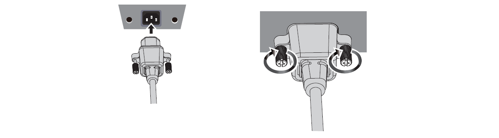
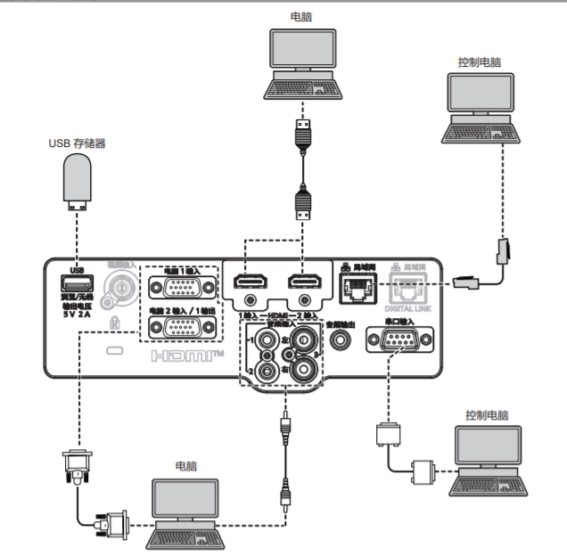
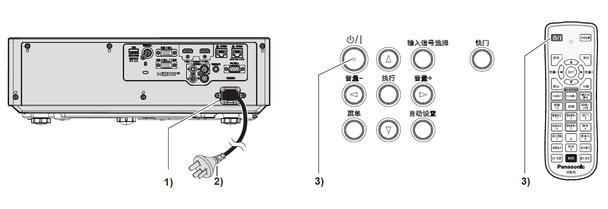
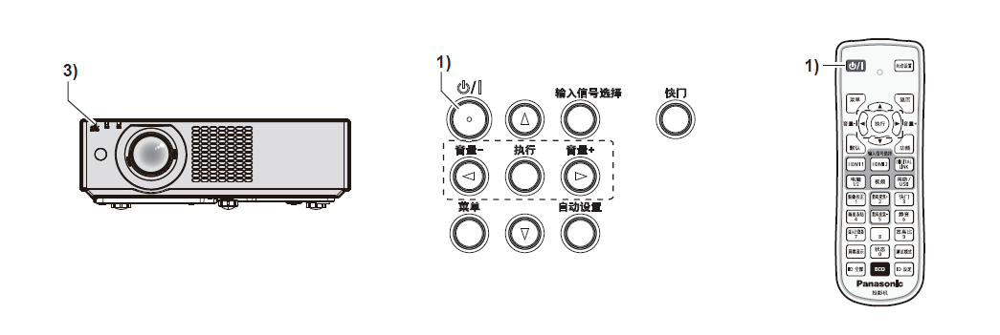

二、打开和关闭
##############
I. 连接电源线
*************

确保附送的电源线牢牢固定到投影机机身的<电源接口>端子，防止电源线轻易脱落。

有关电源线处理的详情，请参阅“重要安全提示”

1. **检查投影机背面的<电源接口> 端子和电源线连接器的形状，然后按正确的方向完全插入接口**
2. **拧紧电源线连接器左右的固定螺钉，使电源线牢牢固定在<电源接口>端子上。**
   
**注意**：如果不使用或未拧紧电源线连接器左右的固定螺钉，则可能造成电源线连接器和<电源接口>端子之间的接触不良。关于电源线的维修，请咨询经销商。

II. 连接电脑 
************

将投影机连接到电脑或外围设备时，请使用各设备附带的电源线。

1. 首先准备好带有连接口的控制电脑，并开机。
2. 将转接线连接到个人电脑的接口端和控制电脑的接口端。
3. 连接准备就绪，开始使用。

III. 开启投影机
******************

开启投影机之前，先将投影机与外围设备连接好并取下镜头盖。

1. 将电源线连接到投影机。

2. 将电源插头连接到电源插座。
 
   * 电源指示灯<开（绿）/待机（红）> 点亮或闪烁，投影机将进入待机模式。

4. 按电源按钮 

   * 电源指示灯<开（绿）/待机（红）> 呈绿色点亮，图像很快显示在屏幕上。

- 当［投影机设置］菜单→［节能模式管理］→［待机模式］设为［节能］时，与设为［普通］相比，打开电源后需要更长时间投影才会开始。

- 如果［投影机设置］菜单→［节能模式管理］→［快速开机］设为［开］， 在投影机进入待机模式后经过指定时间之前打开电源，在电源打开约一秒后投影图像。

IV. 通过USB连接
***************

Memory Viewer 功能可以投影出 USB 存储器中的静态图像。

- 兼容市售 USB 存储器。

- 不能使用 FAT16 和 FAT 32 之外的其他格式。

- 请勿使用 USB 延长电缆或USB 集线器，请将 USB 存储器直接插入投影机的<USB (浏览 / 无线/ 输出电压)>端子。

1. 将 USB 存储器插入<USB>端子。

2. 按遥控器上的<网络/ USB>按钮将输入源切换为USB 浏览。
   
   按控制面板上的 <输入信号选择>按钮，并在输入菜单中选择输入源。

3. 按遥控器上的<执行>按钮。

   USB 存储器的根目录将显示在缩略图中。

4. 按遥控器上的上下左右键选择一个文件。

5. 按遥控器上的<执行>按钮，执行文件播放。

   图片以全屏显示。

V. 关闭投影机
**************

1. **按下电源按钮** 

   显示[关闭电源]确认画面。

2. **按左右键选择 [执行]，并按 <执行> 按钮。**

   （或再次按下电源按钮）

   投影画面停止，投影机上的电源指示灯<开（绿）/待机（红）> 呈橙色点亮。（此时风扇仍然运转）

3. **等待至投影机上的电源指示灯<开（绿）/待机（红）> 呈红色点亮或闪烁。**
   
   电源指示灯 <开（绿）/待机（红）> 呈红色点亮或闪烁时投影机进入待机状态。

4. **将电源线插头从插座拔出。**
