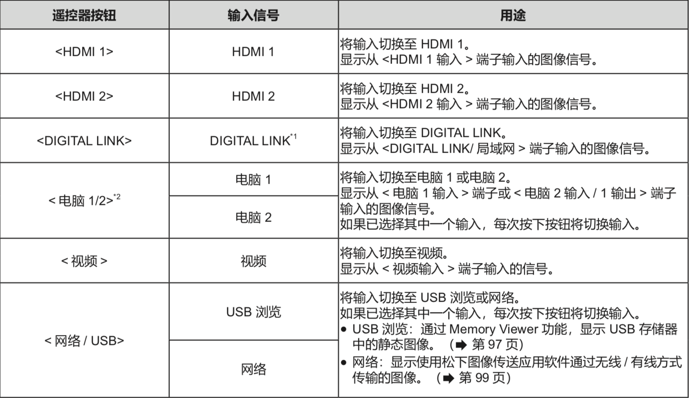

三、投影使用
##############

I. 投影信号选择
************************************

1) 通过遥控器切换输入信号
+++++++++++++++++++++++++++++++++++++++++

可以通过按下遥控器上的输入信号选择按钮直接切换输入信号。

按下输入选择按钮(<HDMI 1>、<HDMI 2>、<DIGITAL LINK>、< 电脑 1/2>、< 视频 >、< 网络 / USB>)。

不适用于PT-BMZ40C、PT-BMX50C。

如果[投影机设置]菜单→[COMPUTER2输入输出选择]设置为[电脑1输出]，则不能选择电脑2输入。

.. note:: 

   * 图像可能无法正确投影，这取决于要播放的外部设备、蓝光光盘或 DVD 光盘。根据输入信号设置以下菜单选项。

   * 确认投影屏幕和图像的宽高比，然后通过[位置]菜单→[宽高比]切换至最佳宽高比。

   * 当选择网络输入时，可以使用松下图像传送应用软件通过无线 / 有线方式投影计算机(包括 iPad / iPhone / iPod touch 设备 ) 上的图像。

2) 通过控制面板切换输入信号
+++++++++++++++++++++++++++++++

可以通过控制面板上的< 输入信号选择 > 按钮来切换输入。

按下 < 输入信号选择 > 按钮后，将显示具体或简单输入向导。

1. 按下控制面板上的 < 输入信号选择 > 按钮

   * 显示输入向导。

2. 再次按下 < 输入信号选择 > 按钮。

   * 每次按 < 输入信号选择 > 按钮，都会切换输入。

   * 显示 [ 具体 ] 输入向导时，可以使用遥控器或控制面板上的上下左右按钮选择输入。

II. 遥控器使用
**************

1) 使用调整音量按键
+++++++++++++++++++++

遥控器的某些按键可以控制扬声器音频输出的音量

遥控器的音量按键如图所示：

   .. image:: images/音量键.png
      :scale: 50%
      :align: left

1. 按一下左侧“音量-”按钮，音量减小一个单元

2. 按一下左侧“音量+”按钮，音量增大一个单元

2) 使用画面冻结按键
+++++++++++++++++++++++++++++++++++++++++

无论外部设备是否在播放，都可以暂停投影画面或关闭音频。

这是画面冻结按键：

   .. image:: images/画面冻结.png
      :scale: 50%
      :align: left

1. 按一次“画面冻结”按钮

   * 画面冻结且音频静音

2. 按两次“画面冻结”按钮

   * 画面冻结取消，音频播放恢复

3) 静音功能
++++++++++++++++++++++++++

可以暂时关闭音频。

   .. image:: images/静音按钮.png
      :scale: 50%
      :align: left

1. 按遥控器上的 <静音>按钮

   音频关闭

2. 再次按 <静音>按钮

   音频再次出现

4) 动态对比度功能
+++++++++++++++++++++++++++++++++++++++++

根据图像自动执行光源调整和信号补偿以产生最佳对比度的图像。

[动态对比度]仅可在有信号输入时才能设置。

1. 按遥控器上下键选择[动态对比度]。

2. 按遥控器左右键或 <执行> 按钮。

   随即显示［动态对比度］个别调整画面。

3. 按遥控器左右键切换项目

   * [关]：禁用动态对比度功能。

   * [1]： 以较小程度调整光源并补偿信号。

   * [2]： 以较大程度调整光源并补偿信号。

   * [用户]：当输入视频信号的亮度低于特定值时，光源可设为关闭。

5)强光感应
+++++++++++++++++++++++++++++++++++++++++
即使在较亮的光线下投影图像，用户也可以将图像调节为最佳亮度。

1. **按上下键选择［强光感应］**

2. **按左右键或 <执行> 按钮。**

   显示［强光感应］个别调整画面。

3. **按左右键切换项目。**

   每次按按钮都会切换项目。

.. note:: 
   * 当［投影机设置］菜单→［投影方法］设置为［背投/地装］或［背投/吊装］时，［强光感应］不能设置为［自动］ 。

   * 当有物品放在投影机上面挡住亮度传感器时，可能无法正确检测亮度，此时，即使设置为［自动］，此功能也可能无法正常运作。

6)色温调整
++++++++++++

   当投影图像中的白色部分变为偏蓝或偏红时，可以切换色温。

1. **按上下键选择［色温设定］。**

2. **按左右键或 <执行> 按钮。**

   显示［色温设定］个别调整画面。

3. **按左右键切换项目。**

   每次按按钮都会切换项目。

   .. image:: images/色温设定.png
      :scale: 30%
      :align: left

7)亮度调整
+++++++++++
可以调整投影图像的较暗（黑色）部分。

   .. image:: images/亮度调整.png
      :scale: 30%
      :align: center

1. 按上下键选择[亮度]。

2. 按左右键或< 执行 > 按钮。

   * 显示[亮度]个别调整画面。

3. 按左右键调整等级

III. 菜单导航的使用
*******************

屏显菜单用于执行投影机的各项设置和调整。

这是遥控器上的菜单按键

   .. image:: images/菜单按键.png
      :scale: 50%
      :align: left

1. 按遥控器或控制面板上的 “菜单” 按钮。

   * 显示主菜单画面

   .. image:: images/主菜单画面.png
      :scale: 50%
      :align: center

2. 按上下键从菜单选择项目

   * 所选中项目以黄色高亮显示。

   .. image:: images/主菜单画面2.png
      :scale: 50%
      :align: center

3. 按“执行”按钮

   * 可以操作所选主菜单的子菜单。

   .. image:: images/主菜单画面3.png
      :scale: 50%
      :align: center

4. 按上下键选择所需的子菜单项目，按左右键或<执行>按钮切换或调整设置。

   * 比如，根据菜单项目，按左右键可以显示有条状比例的个别调整画面，并且可以调大或调小。如下图：

   .. image:: images/主菜单画面4.png
      :scale: 50%
      :align: center
