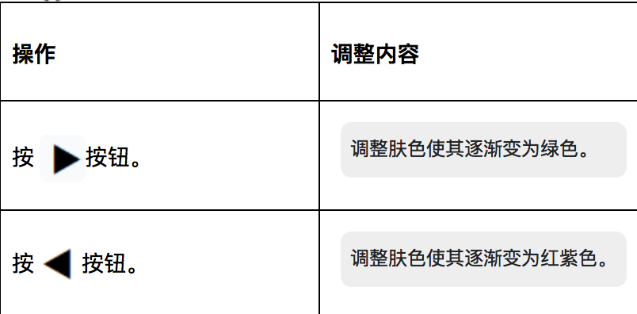
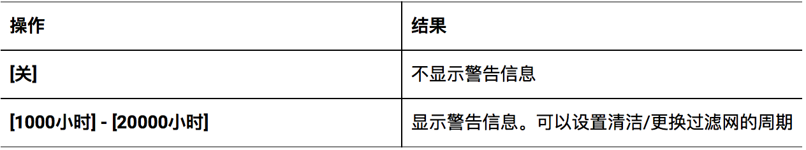

四、故障排除
##############

I. 图像模糊
*************

**故障描述：**

投影出来的图像模糊不清

**故障原因一：**

镜头盖还安装在镜头上

**解决方案：**

移除镜头盖

**故障原因二：**

镜头焦距设置不正确

**解决方案：**

1. 调整变焦和聚焦。

* 旋转聚焦调节杆调整焦距。

* 旋转变焦调节杆调整图像大小以适合屏幕。

2. 调整镜头移位。

* 旋转水平镜头移位调节圈和垂直镜头移位调节圈调整屏幕上的水平和垂直方向的投影位置。

**故障原因三：**

投影距离不适当

**解决方案：**

根据屏幕尺寸和屏幕位置来调整画面尺寸和画面位置。

**故障原因四：**

镜头脏污

**解决方案：**

擦拭镜头。

**故障原因五：**

投影机安装没有与屏幕垂直

**解决方案：**

联系经销商维进行维修或重新安装。

Ⅱ.色彩异常
*************

**故障描述：**

投影颜色苍白或变灰。

**故障原因一：**

[彩色] 或 [色度] 调整出现问题

**解决方案：**

1. 检查[彩色]，调整投影图像的色彩饱和度。

- 按上下键选择[彩色]。

- 按左右键或<执行>按钮。

    - 显示[彩色]个别调整画面。

- 按左右键调整等级。

.. image:: images/色彩异常.png
   :scale: 50%
   :align: center

2. 检查[色度]，调整投影图像的肤色。
- 按上下键选择[色度]。

- 按左右键或<执行>按钮。
    - 显示[色度]个别调整画面。

- 按左右键调整等级。

**故障原因二：**
连接到投影机的外部设备没有调整正确

**解决方案：**
检查连接投影仪的笔记本电脑等外部设备

**故障原因三：**
RGB 线缆损坏

**解决方案：**
更换RGB 线缆

Ⅲ.画面宽高比问题
******************

**故障描述：**
投影出来的图像宽高比不适应屏幕。

**未设置屏幕长宽比**

这可能需要您通过遥控器进行屏幕长宽比的设置。步骤如下：

**解决方案**

1. 点击遥控器上的“菜单”按键

2. 在打开的菜单上选择“屏幕设定”

3. 接着选择“屏幕格式”

4. 按上下键按键可以选择屏幕格式

5. 按遥控器的<执行>按键，选择“自动”。

   “自动”模式会直接检测图像长宽比，并根据屏幕大小自行调整。

6. 更多操作请根据下表选择：

.. image:: images/宽高比.png
   :scale: 30%
   :align: center

Ⅳ.画质问题
*************

**故障描述：**

视频画质差、噪点多。

**故障原因：**

可能您未正确降噪。

**解决方案：**

1. 按遥控器上的按键选择“降噪”

2. 按“执行”按键
显示“降噪”个别调整画面

3. 按左右键切换项目
- 每次按按钮都会切换项目

4. 操作和口令对应关系如下表：

.. image:: images/画质.png
   :scale: 50%
   :align: left

Ⅴ.没有音频输出
***************

**故障原因一：**

外部设备没有正确连接到音频输入端子

**解决方案：**

检查音频线缆是否正确连接、连接是否稳固

**故障原因二：**

音量设置过小

**解决方案：**

使用遥控器或是控制面板增大音量，按下<音量+>按钮。

**故障原因三：**

启用了快门功能

**解决方案 ：**

1. 按遥控器或控制面板上的 <菜单>按钮。

2. 按  从主菜单选择项目[显示方式菜单]

3. 按选择[ 快门设置]。

4. 按< 执行> 按钮，选择[开机]。

**故障原因四：**

启用了静音功能

**解决方案：**

使用遥控器或是控制面板增大音量，按下<音量+>按钮。

**故障原因五：**

[音频设定] 中的音频输入选择设置不正确

**解决方案：**

1. 按遥控器或控制面板上的 <菜单>按钮。

2. 从主菜单选择项目[摄影机设置菜单]。

3. 选择 [音频设定]。

4. 按<执行> 按钮，显示[音频设定] 画面。

.. image:: images/音频输出.png
   :scale: 50%
   :align: center

Ⅵ.没有图像出现
*********************

**故障描述：开启投影机后，未能显示图像**

**故障原因一：**

外部设备没有正确连接到视频输入端子。

**解决方案：**

检查视频线缆是否正确连接、连接是否稳固

**故障原因二：**

视频信号输入选择设置错误。

**解决方案：**

1. 通过按下遥控器上的输入信号选择按钮来切换输入信号，在（<HDMI 1>、<HDMI 2>、<DIGITAL LINK>、<电脑 1/2>、<视频>、<网络/ USB>选项中进行正确选择

2. 通过控制面板上的<输入信号选择>按钮来切换输入，根据向导指示进行操作。

**故障原因三：**

亮度设置为了最小值

**解决方案：**

1. 按遥控器或控制面板上的 <菜单>按钮。

2. 从主菜单选择项目[图像菜单]

3. 选择[亮度]。

4. 调整亮度

**故障原因四：**

投影机所连接的外部设备未正常运行。

**解决方案：**

检查外部设备，如电脑的运转情况

**故障原因五：**

启用了快门功能

**解决方案：**

1. 按遥控器或控制面板上的 <菜单>按钮。

2. 从主菜单选择项目[显示方式菜单]

3. 选择[ 快门设置]。

4. 按<执行> 按钮，选择[开机]。

Ⅶ.控制面板上的按钮不工作
**************************

**故障描述：**

控制面板上的按钮不工作。

**故障原因：**

[控制设备安装] 中的 [控制面板] 设置是否设为 [无效]？

**解决方案：**

1. 按上下左右键选择[控制设备安装]。

2. 按 <执行> 按钮。

3. 在 [控制面板] 和 [遥控器] 之间选择一项。 

4. 在 [有效] 和 [无效] 之间切换。

5. 显示确认画面时，按左右键，选择 [执行]，再按 <执行> 按钮。

Ⅷ.遥控器不工作
**************************

**故障描述：**

遥控器不工作

**故障原因一：**

电池电量是否耗尽？

**解决方案：**

试下换电池

**故障原因二：**

电池极性是否设置正确？

**解决方案：**

打开盖板按下图检查

.. image:: images/盖板.png
   :scale: 50%
   :align: center

**故障原因三：**

遥控器与投影机的遥控信号接收器之间是否存在任何障碍物？

**解决方案：**

1. 如果遥控器与遥控器信号接收器之间存在障碍物，遥控器可能无法正常工作。

2. 如果投影机接收到遥控信号，电源指示灯<开（绿）/待机（红）>将会闪烁。

**故障原因四：**

遥控器是否处于其有效操作范围之外？

**解决方案：**

1. 将遥控器直接对准机身遥控器信号接收器操作时，有效接收距离最大为 30 m (98'5")。遥控器在垂直及水平最大±30°角度内可用，但有效控制范围可能会缩小。

2. 信号将被反射出屏幕。但操作范围可能有限，因为不同的屏幕材质会产生不同的光反射损失。

**故障原因五：**

遥控器是否受到（如荧光灯）干扰？

**解决方案：**

如果遥控信号接收器直接受到荧光等强光的照射，遥控器可能无法正常工作。使用遥控器时应远离光源。

Ⅸ.无法开机
**************************

**故障描述：**

投影仪没法打开

**故障原因一：**

电源插头没有完全插入电源插座中

**解决方案：**

重新插牢电源插头

**故障原因二：**

壁装电源插座没有正常供电

**解决方案：**

检查电源插座是否能正常供电

**故障原因三：**

电路断路器跳闸

**解决方案：**

检修电路

**故障原因四：**

光源指示灯 <光源> 没有点亮或闪烁

**解决方案：**

1. 将投影机断开电源线，然后再次通电。光源指示灯<光源>可能不点亮或不闪烁。

2. 如果采取措施后光源指示灯<光源>依然点亮或闪烁，请关闭投影机并断开电源线，联系经销商维进行维修。

Ⅹ.HDMI设备视频音频播放不正确
****************************

**故障描述：**

HDMI设备不能正确播放视频音频。

**解决方案：**

将连接设备设置为线性PCM 音频。

Ⅺ.弹出滤网计数警告信息
**************************

**故障描述：**

屏幕弹出过滤网计数警告

**故障原因：**

过滤网的使用时间达到设定时间时，投影画面上 会显示滤网清洁 / 更换的警告信息：“滤网计数已到达设定时间”。滤网计时器需要及时设置。

**解决方案：**

1. 按遥控器的按键选择“滤网计数”

2. 按遥控器的<执行>按键按钮

3. 选择“计时器”
4. 切换计时器设置

